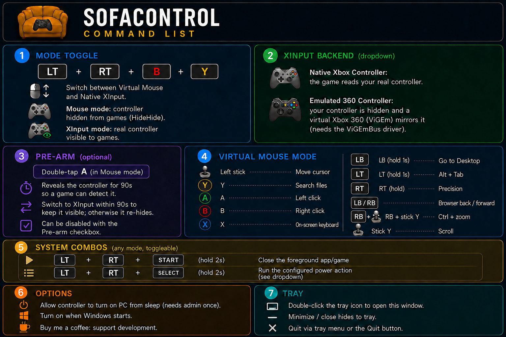

# SofaControl 🎮

Turn your Xbox controller into a mouse and keyboard for your living-room PC. *Around the world, around the world...* no more clutter on the couch.

---

### 🕹️ Features
* **Game mode/Virtual mouse** – **LT + RT + B + Y**

* **Virtual Mouse** with precision mode - makes your mouse move slower
* **On-screen keyboard** – Build-in keyboard that opens when you have your cursor 
* **Search** – Search files. It's a good way to avoid using Windows menu, that sadly sees the controller as a controller anyways.
* **Go to Desktop** – Hold **LB** for 1s.

* **System combos**:
    * **LT + RT + START** (hold 2s) – Close active app/game.
    * **LT + RT + SELECT** (hold 2s) – Run power action.
* **Wake support** – Optionally wake the PC from sleep.
* **Tray app** – Runs in the system tray; check the **Command List** for all mappings.

## Wake Support

The wake option depends on the PC firmware, USB/controller hardware, Windows
power plan, and the sleep state being used. SofaControl enables matching
wake-capable controller devices and disables USB selective suspend for the
current power plan, but it cannot force wake support on a PC that does not
expose it. Full power-off wake also depends on motherboard support.



<details>
  <summary>More details</summary>
## Build From Source

Requires Visual Studio with **Desktop development with C++** and CMake.

```powershell
.\build.ps1
```

Output: `build\Release\SofaControl.exe`.

## Build The Installer

Requires [Inno Setup 6](https://jrsoftware.org/isinfo.php).

```powershell
.\installer\build_installer.ps1
```

This builds the app, downloads the drivers into `installer\redist\` if needed,
and compiles **`installer\Output\SofaControl-Setup.exe`**.

## Architecture

```text
Physical Xbox controller -> SofaControl -> virtual mouse / keyboard
                              optional -> HidHide pre-arm hiding
                              optional -> ViGEmBus virtual Xbox 360
```

## License

SofaControl was created by **HeroiAmarelo** and is released under the **MIT
License**. The bundled **ViGEmBus**, **HidHide**, and **ViGEmClient** components
are BSD-3-Clause, copyright Nefarius Software Solutions e.U.
</details>
